# realraum AirRohr Bastel Workshop

## DIY Feinstaubsensor

---
# Die Map

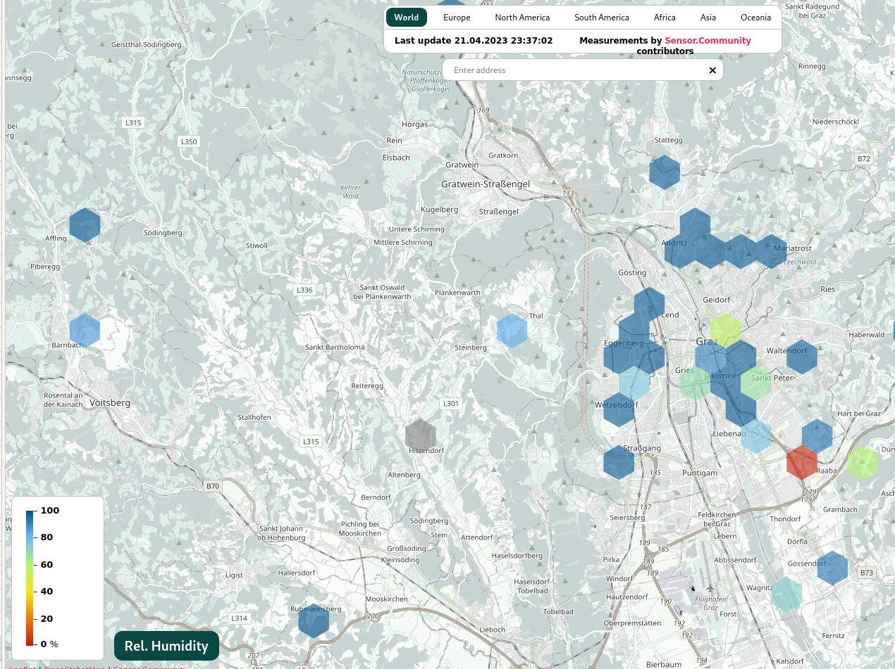

---

# Die Map ist groß


http://sensor.community

---
# Mögliche Hacks

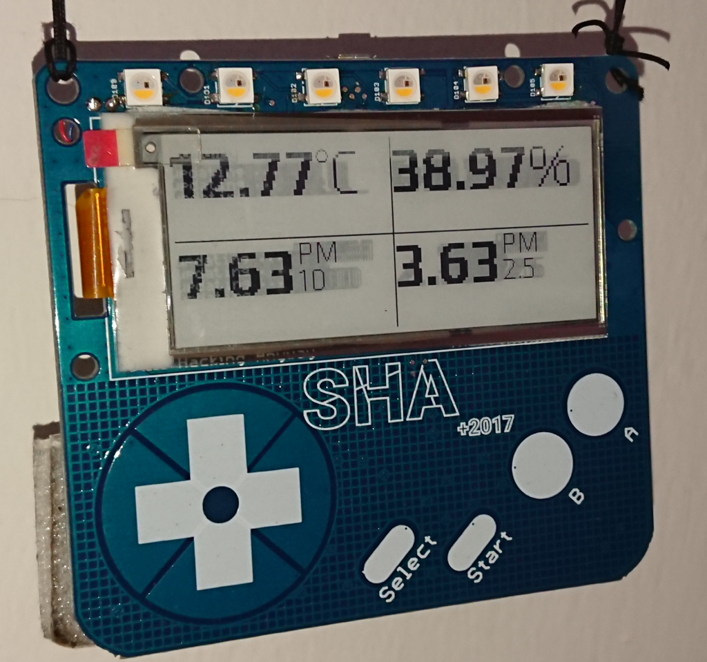

---

# Voraussetzungen

- Hardware
- idealer Montageort
  - WLAN Empfang
  - 1,5m bis 3,5m über der Straße
  - gut belüftet.
  - Abweichungen bei Anmeldung angeben

---

# Beispiel Montage

## Airrohr

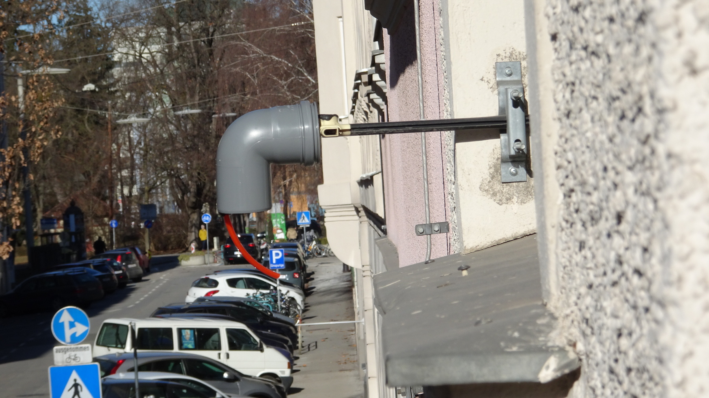

- klassisch
- straßenseitig
- guter WLAN Empfang
- 503cm Höhe

---
# Beispiel Montage

## Airrohr

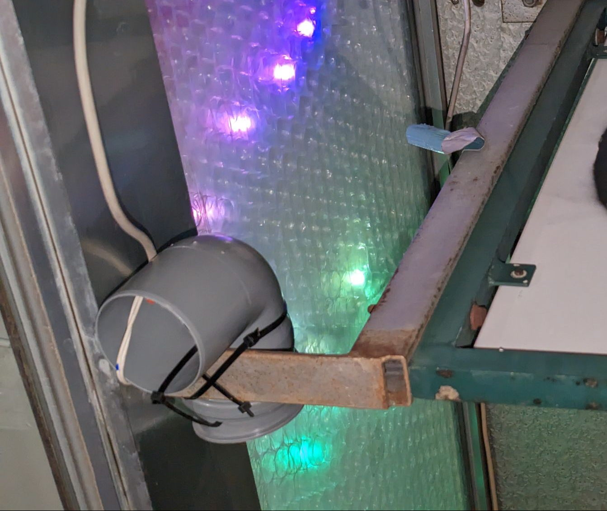

- klassich
- straßenseitig
- mittelguter WLAN Empfang hinter Eisen
- 257cm Höhe
- der r3 Sensor
---

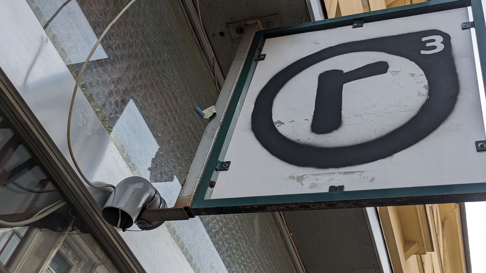

---
# Beispiel Montage 

## Box


- unscheinbare Box
- ca 1m Höhe
- knapper WLAN Empfang
- Innenhof


---
# Workshop Ablauf

1. sensor.community Account registrieren
2. µC Firmware flashen + ID aufschreiben
3. Sensor in eigenem sensor.community Account registrieren
4. am µC Sensoren & lokales WIFI konfigurieren
5. Sensor physisch zusammenbauen

---
# Link zu den Folien

- verlinkt in Seite zum Termin / Event / Talk
- https://realraum.github.io/sensor_community_airrohr_workshop/


---
# Account registrieren

[http://devices.sensor.community](https://devices.sensor.community/)

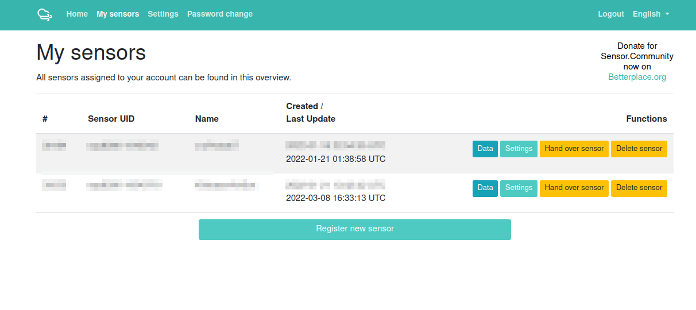

---

# Airrohr Flashing Tool


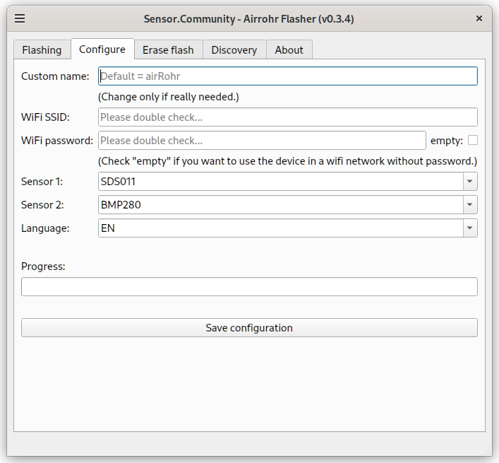

---
# Zuverlässig FlashingTool zum Laufen bekommen

```
git clone https://github.com/opendata-stuttgart/airrohr-firmware-flasher
cd airrohr-firmware-flasher
python -m venv airrohr_venv             # Python Virtual Env anlegen
source ./airrohr_venv/bin/activate      # Python Virtual Env aktivieren
echo Versionen von pyqt5-sip und pyqt5 entfernen:
vim requirements.txt
pip3 install -r requirements.txt        # Deps installieren
```

Tool starten
```
./airrohr_venv/bin/python3 ./airrohr-flasher.py
```

Serial Monitor - Check of Firmware etwas tut
```
python3 -m serial.tools.miniterm /dev/ttyUSB0 9600
```
---

# Sensor Configuration

via Firmware-Webpage and Accesspoint

- SDS011
- BME280

Sensor ID ablesen und notieren!

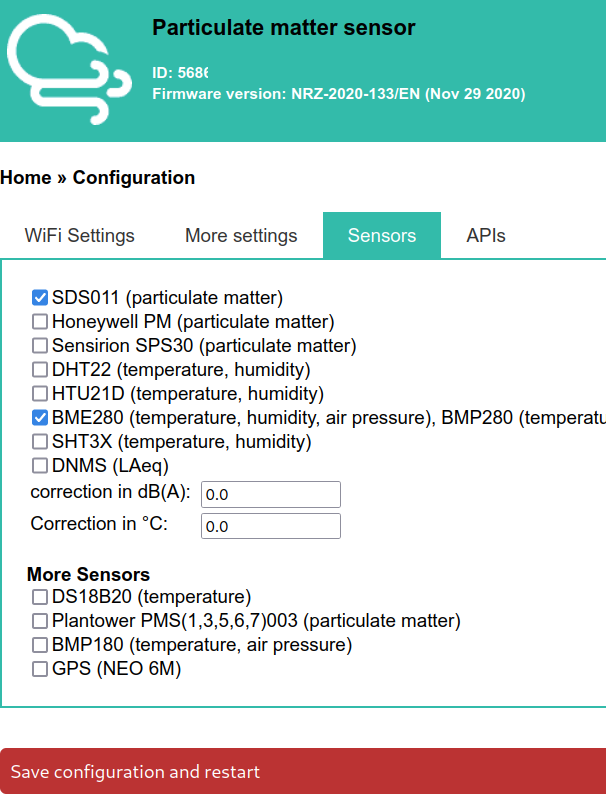

---
# Sensor ID registrieren

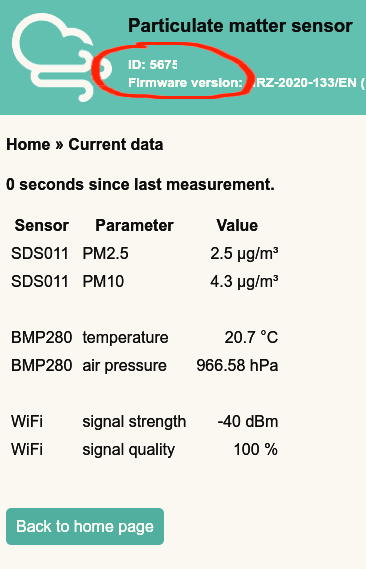

- Sensor registrieren auf [http://devices.sensor.community](https://devices.sensor.community/)
- Sensor ID ablesen
  - links oben auf Webseite des ESP8266 wenn im WLAN
  - oder am Airrohr-Flasher-Tool in der Statusleiste, wenn via USB verbunden

---

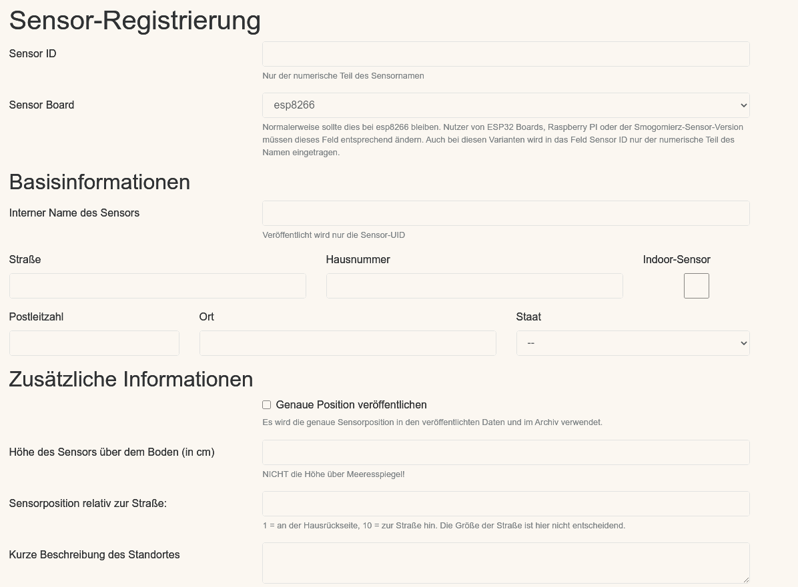

---

# Airrohr Bauanleitung


- [Anleitung](https://sensor.community/de/sensors/airrohr/), auch gut am Handy zu lesen


&nbsp;&nbsp;&nbsp;&nbsp;&nbsp;&nbsp;&nbsp;&nbsp;&nbsp;&nbsp;&nbsp;&nbsp;[Soldering Tipps, falls nötig](https://mightyohm.com/files/soldercomic/FullSolderComic_EN.pdf)

---

# Kit Inhalt

- SDS011 [Amazon](https://www.amazon.de/s?k=sds011)
- JumperWire f/f x4
- ESP8266 NodemMCU
- BMP280 (mit Aufpreis BME280)
- Fliegengitterstück [Obi](https://www.obi.at/insektenschutznetze/windhager-is-fliegengitter-anthrazit-130-cm-x-220-cm/p/1815869)
- Marley HT-Bogen DN 75 Grau [Obi](https://www.obi.at/ht-boegen/marley-ht-bogen-87-dn-75-grau/p/2010577), [Hellweg](https://www.hellweg.at/ht-bogen-75-mm/197275)
- optional AirRohr PCB + extra C1
- optional micro-USB-Kabel

---

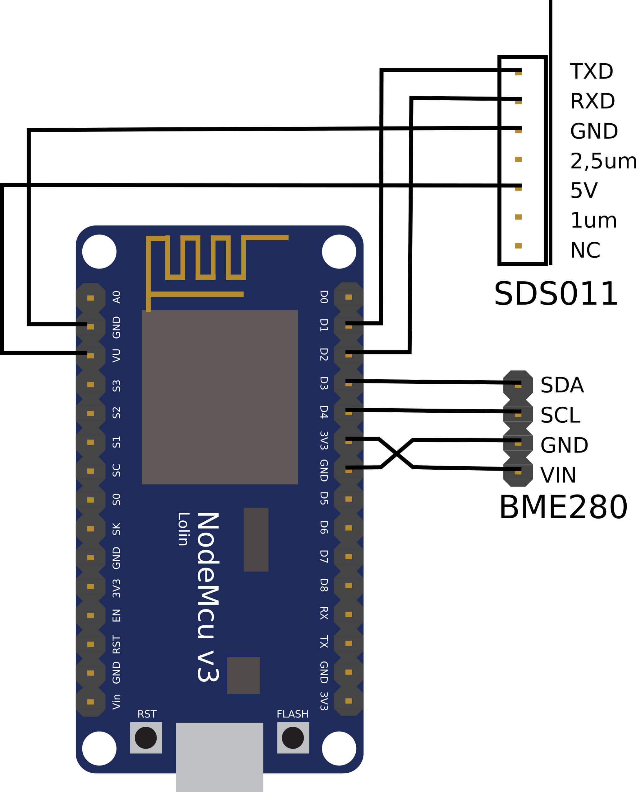

---

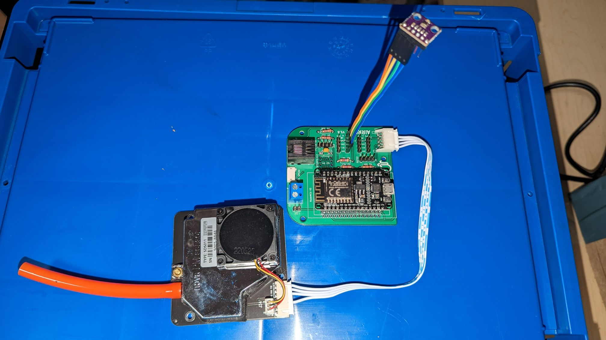

---

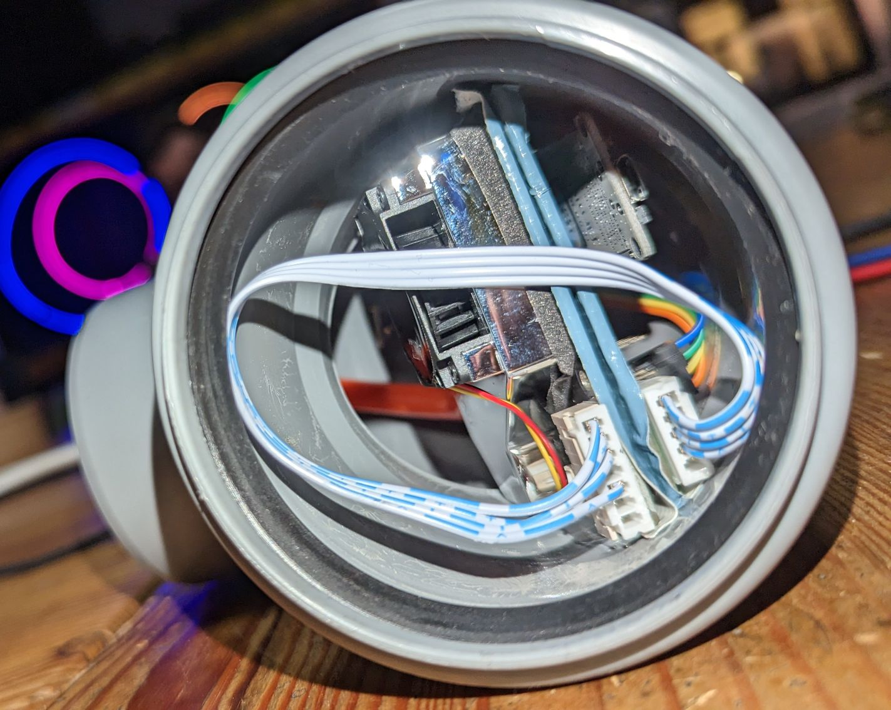


---
# WLAN neu konfigurieren

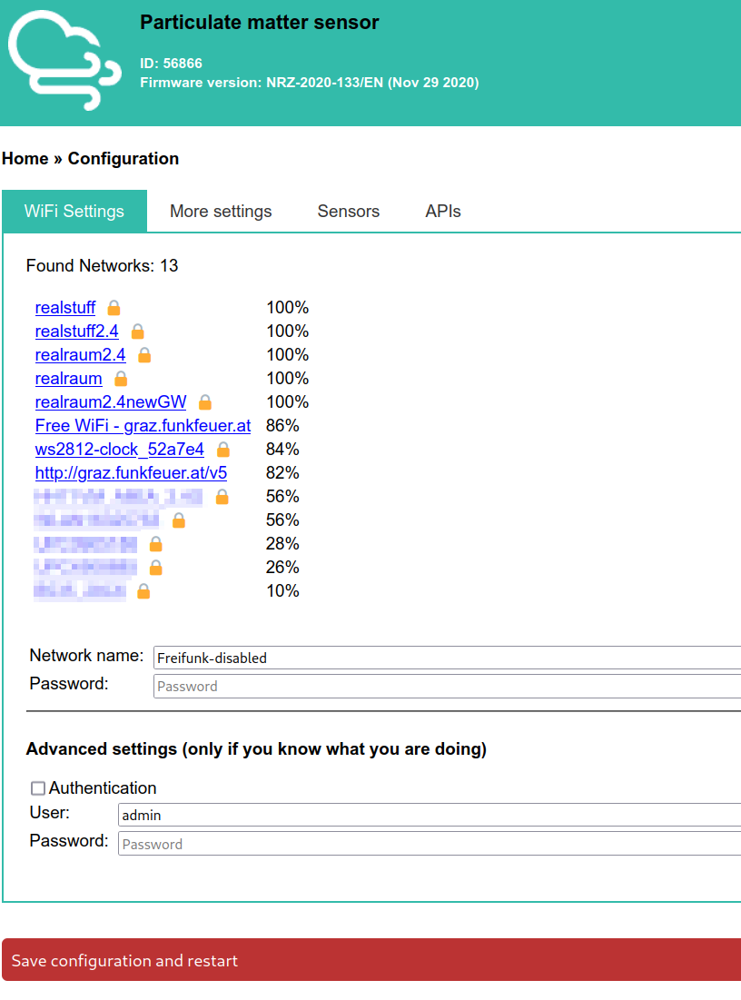

- Daheim ins eigene WLAN
- Wenn FW konfiguriertes WLAN nicht mehr sieht, macht sie einen AccessPoint auf
  - auf deren Webseite, kann WLAN konfiguriert werden

- Alternativ: Airrohr-Flasher-Tool

---
# IP im WLAN finden

- eigenen Router/AP fragen, welche Geräte im WLAN sind
- multicast-DNS mit Laptop im selben WLAN:
  - Airrohr Flashing Tool - Discovery Page
  - `avahi-browse -a -v --resolve | less`
- Terminal via USB-Kabel:
  - `python3 -m serial.tools.miniterm /dev/ttyUSB* 9600`
  - https://bipes.net.br/aroca/web-serial-terminal/ mit Speed 9600
  - µC Reset und Terminal Output lesen

---
# Kit Unkostenbeitrag

- ca 52€
- QR Code für Banking Apps


---
# WLAN Distanz überbrücken für Experten

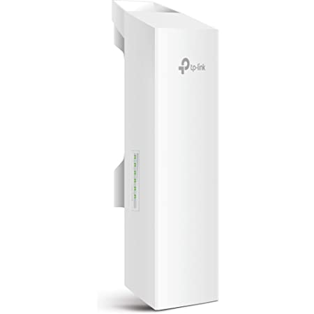

- e.g. [Amazon](https://www.amazon.com/TP-Link-Long-Range-Outdoor-Transmitter/dp/B07YX8NPFL/)
- Hilfe im realraum oder bei Funkfeuer holen

---

# Firmware Download für Experten

- http://firmware.sensor.community/

---

# DMNS Bauanleitung


---


# DMNS Standort Wetterschutz

- Schaumstoffabdeckung unbedingt nötig
- notfalls Haushaltsschwamm

Weil:
- schützt vor Windgeräuschen
- schützt vor Wasseraustritt Kondenswasser
- schützt vor Sonneneinstrahlung


---

# DMNS Standort Mikrofon

- möglichst "freier" Bereich zu platzieren
  - möglichst wenig schallreflektierenden Flächen
  - Der Abstand zu reflektierenden Flächen sollte so groß wie möglich sein.
  - nicht direkt an einer Hauswand
    - idealerweise mehr als 1 m betragen.
    - 50cm ist minimum
  - Gute Plätze sind 
    - z.B. Balkone oder Terrassengeländer
    - direkt an der Hausecke, damit sich Reflexionen auslöschen.
- Je näher man jedoch an die Geräusch-Quelle herankommt, desto besser

